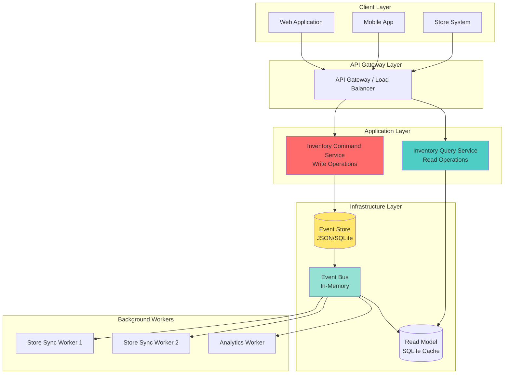
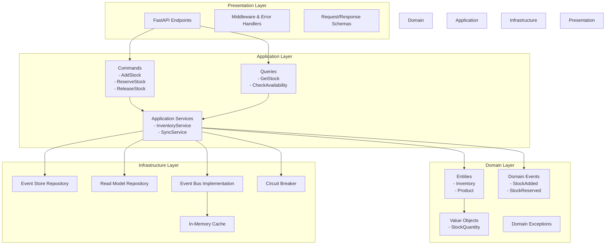
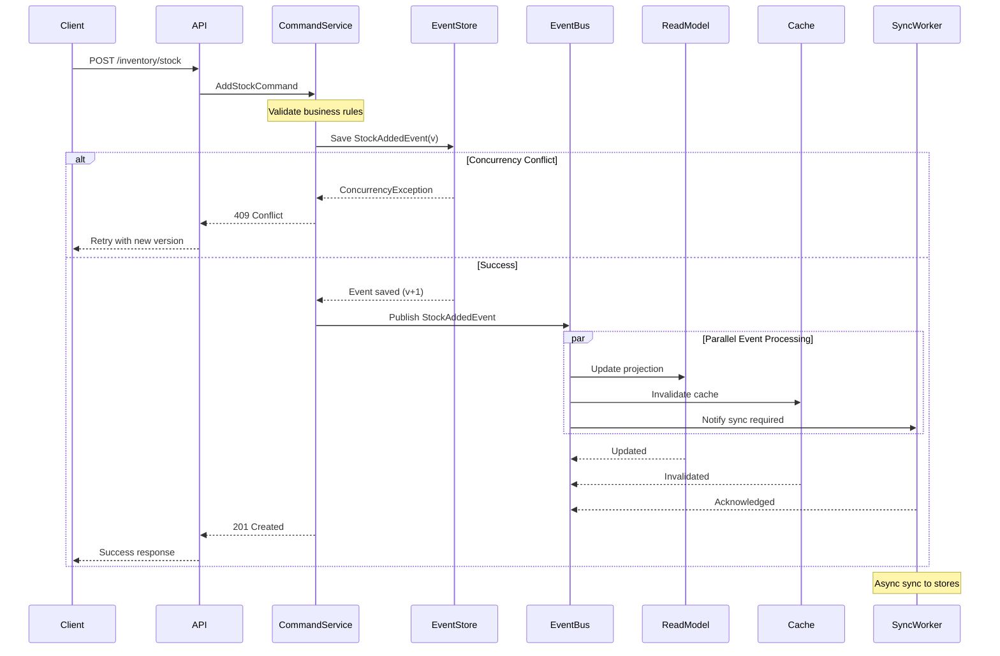
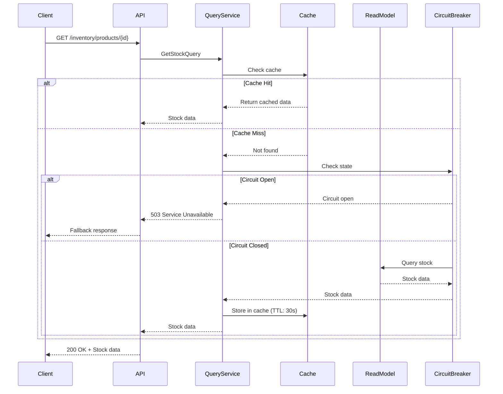
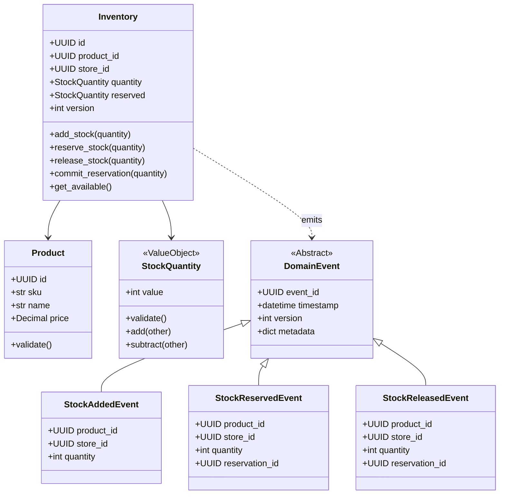
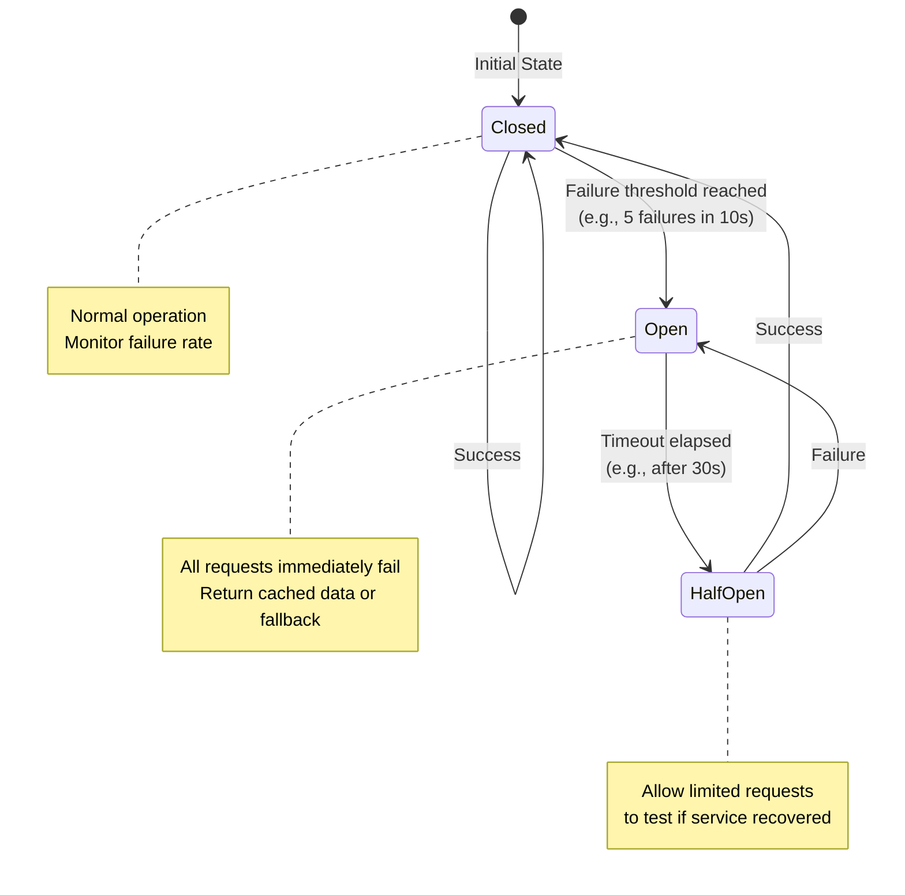
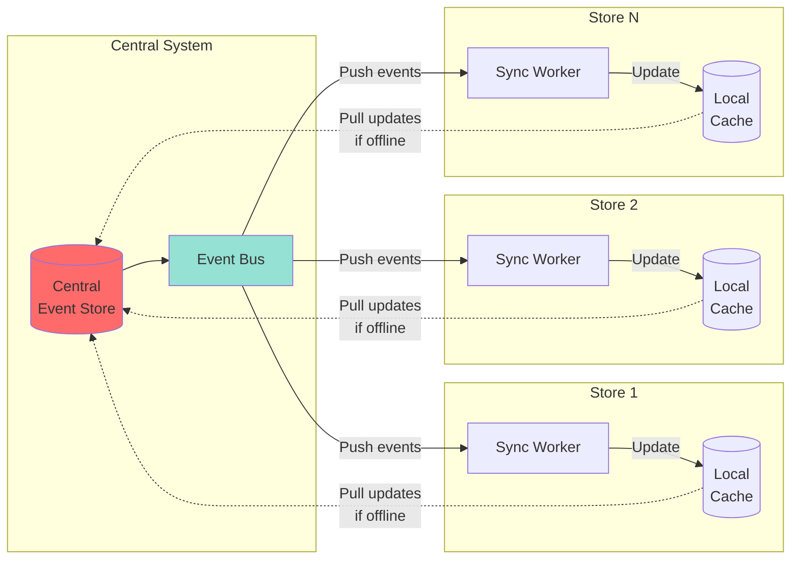
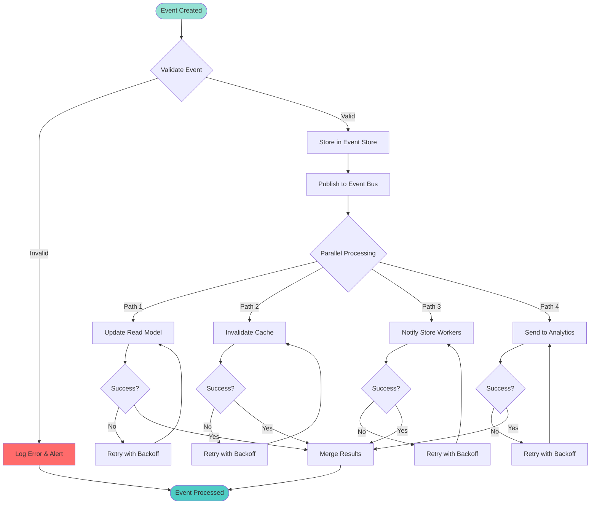

# Architecture Diagrams

This file contains Mermaid diagrams for the system architecture.

## 1. System Architecture Overview



## 2. Clean Architecture Layers



## 3. Event Sourcing Flow



## 4. CQRS Query Flow



## 5. Domain Model



## 6. Circuit Breaker State Machine



## 7. Multi-Store Synchronization



## 8. Event Processing Pipeline



## How to View These Diagrams

1. **GitHub/GitLab**: These platforms render Mermaid automatically
2. **VS Code**: Install "Markdown Preview Mermaid Support" extension
3. **Online**: Copy to https://mermaid.live/
4. **Export**: Use mermaid-cli to generate PNG/SVG files

## Generate Images

```bash
# Install mermaid-cli
npm install -g @mermaid-js/mermaid-cli

# Generate images
mmdc -i docs/DIAGRAMS.md -o docs/diagrams/
```
